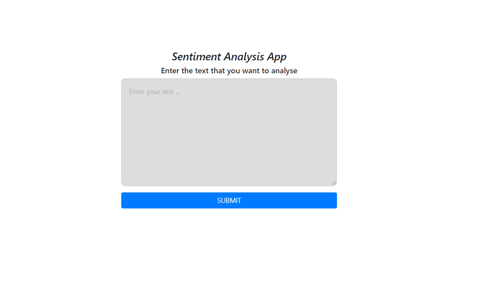
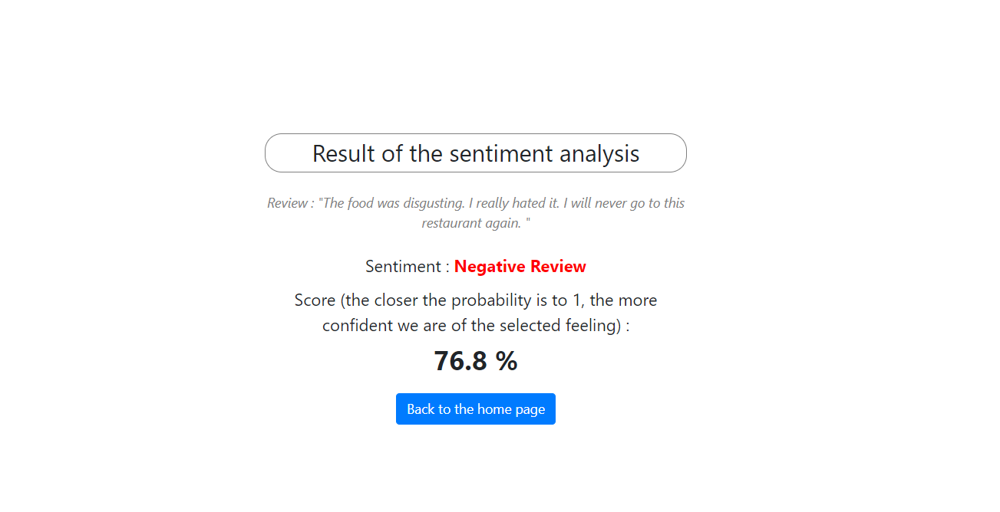
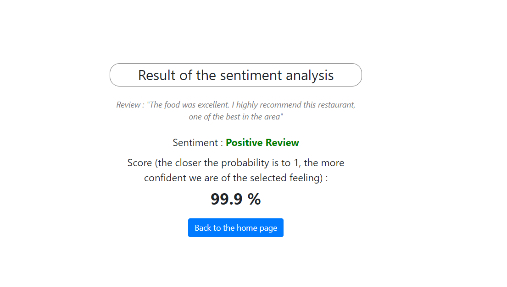

# Sentiment-analysis-app
Sentiment analysis app using Tensorflow and Flask

Creation of an application to perform a sentiment analysis on an input review. Returns the score (probability), as well as the tone of the text (negative or positive).
The model was trained on the Amazon Fine Food Reviews dataset from Kaggle: https://www.kaggle.com/snap/amazon-fine-food-reviews
# Prediction example

## Home Page

## Negative review

## Positive review

